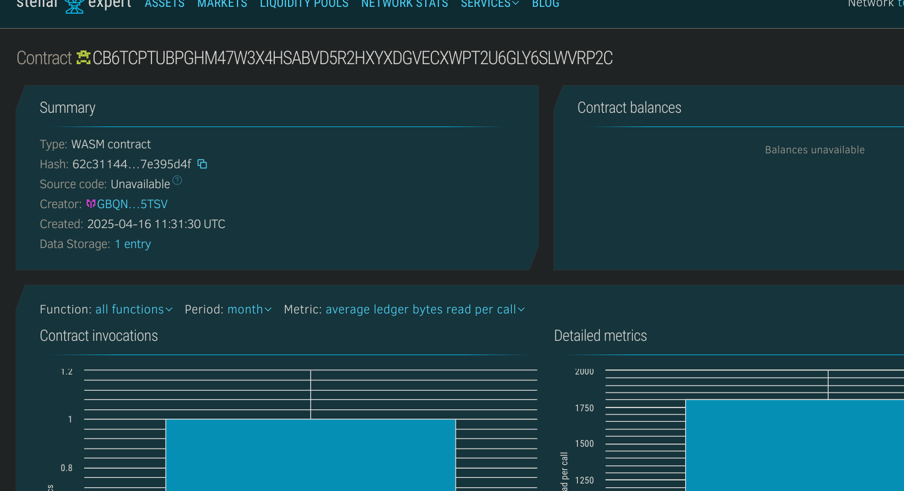

# Multi Wallet Connect dApp

## 📌 Project Title
**multi-wallet-connect-dapp**

---

## 📖 Project Description
A smart contract built using Soroban SDK that allows users to connect multiple wallets under a single identity. It provides functionalities to register, view, and disconnect wallets associated with a user's account.

---

## 🌟 Project Vision
To simplify multi-wallet management for users in decentralized applications. This smart contract allows a seamless experience where users can manage all their connected wallets securely and transparently.

---

## 🚀 Key Features
- ✅ Connect and label multiple wallets to one identity.
- 📜 View all connected wallets with timestamps.
- ❌ Disconnect all associated wallets at once.
- 🔐 On-chain storage for full transparency and decentralized access.

---

## 🔮 Future Scope
- 🧩 Add role-based wallet permissions (e.g., viewer, spender).
- 📱 Integrate with frontend wallet selector tools.
- ⏱ Track session-based wallet connections.
- 🔗 Cross-chain wallet management and metadata support.

## Contract Details
CB6TCPTUBPGHM47W3X4HSABVD5R2HXYXDGVECXWPT2U6GLY6SLWVRP2C
